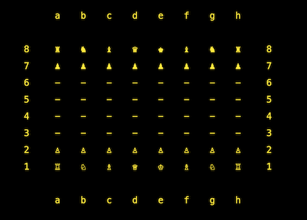

# Project Overview

Chess is the capstone project in [The Odin Project](https://www.theodinproject.com/courses/ruby-programming/lessons/ruby-final-project) Ruby curriulum. 

The assignment is to build a command line chess game where two players can play against each other.

## Challenges

Programming the legal and illegal moves of chess can be challenging. Although one of the most difficult game pieces, the knight, was previously handled in [The Odin Project's Knights Travails](https://github.com/dm-murphy/knights-travails) assignment, the sheer scope of a full chess program along with the special rules for kings and pawns kept this interesting.

###### Blocked Paths and Program Speed

Apart from the knight, no piece can "jump" over another piece to reach its desired destination. The rook, bishop and queen (and even the pawn) can move multiple spaces in a single turn. However the program must account for a blocked path where either a player piece or opponent piece could be in the way. Originally this program used recursion to detect a blocked path, however this slowed the program's move detection just enough to annoy this developer. The blocked path method was refactored into a simple loop that produced an array of spaces which could then be checked as occupied or empty. However some pieces decided that taking a straight line wasn't nearly as fun as zigzagging. Each piece in the program was provided not only with destination moves within the board's limits, but also with next-space moves to use when building paths. This fully sped up the program and solved any zigzag issues for checking the king.

###### King Rules

The king piece cannot move itself into check and cannot ignore being in check, this includes normal moves for the king as well as castling. In order for the king and rook to castle neither piece can have a prior move, there must be no pieces in between them, and the player must select the king, not the rook, to make the castle. Once castled, the player cannot castle again. 

###### The Mighty Pawn

While most pieces could share a single piece module, the pawn piece requires a special method for creating all of its possible moves as well as additional classes to handle specialty pawn rules like pawn promotion and en passant captures. 

The pawn can move forward a single space except on its first turn where it can move foward one or two spaces. The blocked path methods help keep the pawn moves legal here. Although the pawn likes to move forward it can only attack diagonally, making the pawn the only piece that requires separate coordinate changes for moving and attacking. 

In en passant captures the player pawn can take over a seemingly empty square if an opponent pawn has double jumped through the space. However not only must the pawn correctly follow the special en passant rules but it must not impact the basic game rules, such as putting the king in check with an en passant capture. Another challenge to the en passant is that when the turn ends, the availability of a possible en passant capture must be passed along to the opposite player. En passant captures are not automatic, the player must decide on the very next turn if they would like to make the capture or a different move.

If a pawn makes it all the way across the board it can be promoted to another piece. This program allows the player to select any legal promotion, including the rare instances of promoting a pawn to a rook or bishop instead of a queen in order to prevent a stalemate.

###### Win, Lose or Draw

Developing the end of the game requires simultaneously calculating for any possible checks of a king as well as any available player moves. As detailed above, once recursion was removed from this step, the speed on these methods became much quicker. In chess, the game is won when a player places the opponent into check and the opponent has no legal moves available.

For draws, this program detects instances where the player has no available moves and triggers a stalemate. However the program does not utilize a timer so there are no timed game draws. Additionally the project has not been programmed to follow the fifty-move, threefold repetition or dead move rules.

A full depiction of the rules of chess can be found [here.](https://www.chessvariants.com/d.chess/chess.html)

## Design

This program uses a minimalist design that is quick and easy to run locally and on IDEs like Repl.it. The board uses chess unicode symbols for white and black pieces:

The board displays chess notation with letters a - h representing the eight columns and numbers 1 - 8 representing the eight rows.

Players select pieces with standard algebraic notation (e.g. the leftmost white pawn is selected with a2)

The board outputs all available legal moves for the given piece and players again use algebraic notation to choose their move (e.g. the leftmost white pawn can move to a3 or a4 on the opening)

It was a goal of this project to display all legal moves to a player rather than require the selection and move in one entry. This design makes the game easier for beginners and helps reveal legal and illegal moves to learning players.

In an effort to follow chess etiquette, the program does not initially announce when a player is in check. However if the checked player attempts to make an illegal move the board will notify the player that the king is in check.

## Serialization

Players can save their game file on any turn. This allows users to restore a loaded file instead of starting a new game. The program uses YAML for serialization. All statuses in the game are kept in the saved file from the board state and piece positions to any leftover en passant captures, piece first move histories and the current player turn. Game files are saved in a new directory and players can choose which ones to load via a sorted timestamp.

## Tests with RSpec

Spec files were created for most of the core classes. Although some methods were developed with TDD, most of the program was figured out first and tested afterwards. At the start of the project, testing the program with puts messages and a quick entry of piece moves proved easy and effective. However as the program was fleshed out it became more challenging to repeat long entries of piece moves into the command line. As classes and methods were refactored and large portions of the game completely overhauled, old RSpec tests needed to be rewritten and more tests introduced. Ultimately this project proved a good lesson in the importance of testing and some of the difficulties in waiting to test until after the fact.

Attempts were made to distinguish between incoming, outgoing and self sent messages. For many methods, simple queries were not tested. Complex queries and times when issues were repeatedly checked on the command line were given tests. Outgoing commands were tested for sending a command to the outgoing object.

## Branching

Given the scope of the project, local branches were divided up into areas of the game to be developed before merging back into the main program and pushed to the remote repository. This was the first project that fully utilized the concept of branching in git for developing and refactoring. At several points this proved a major asset as it was easy to roll back commits to fix new bugs or check working branches while resolving issues on another feature. Following branches also helped keep the focus on finishing one feature before moving onto another.

## Learning Outcomes

This capstone project was incredibly rewarding for me to develop. I was able to build out the program from scratch without any tutorials or hand holding. Knowing the game of chess well, I was originally timid on some of the special rules like en passant captures, castling, as well as navigating all of the piece interactions. Although challenges arose, this did not prove to be the most difficult part of the project. Instead trying to follow OOP guidelines, maintain single responsibility and utilize testing were the biggest issues. 

Much more refactoring could be done on this project. The MoveGenerator class is currently doing too much heavy lifting and there are several methods that have more than one responsibility. But overall I felt very accomplished in working through this program and seeing what I was capable of building from nothing simply by utilizing the lessons I have learned by working through The Odin Project curriculum. I am amazed that I have been able to get this far with a self-teaching approach and humbled that there seems so much more to learn. 

I am very grateful to all the developers who have contributed to and helped maintain The Odin Project, offering a free and open-source curriculum for developers like myself.

# Play Now

Play on [Repl.it](https://replit.com/@dmmurphy/chess#lib/main.rb)
